# IdeaCook.AI 🍳✨

**Transform organizational knowledge into actionable insights through AI-powered idea synthesis and gamified documentation**


## 🎯 **The Organizational Problem We Solve**

**Knowledge Silos**: Ideas and insights get trapped in individual notebooks, scattered documents, and forgotten meeting notes. Leaders lack visibility into what their teams are actually thinking and working on.

**Poor Documentation Culture**: Without incentives, employees default to minimal note-taking and shallow documentation, leading to lost institutional knowledge and missed innovation opportunities.

**Idea Quality Blindness**: Managers struggle to identify which team members are contributing high-impact thinking versus just generating noise.

## 🏢 **Who IdeaCook.AI Serves**

### **👔 Leaders & Managers**
- **Organizational Intelligence**: See what everyone is working on and thinking about
- **Talent Identification**: Spot your best strategic thinkers through idea quality metrics
- **Knowledge Visibility**: Break down silos and surface cross-team synergies
- **Innovation Pipeline**: Track idea quality trends and team intellectual output

### **👥 General Staff**
- **Recognition System**: Get rewarded for thoughtful documentation and meaningful ideas
- **Professional Development**: Receive AI-powered feedback to improve thinking quality
- **Collaboration Discovery**: See how your ideas connect with others across the organization
- **Career Advancement**: Build reputation through consistent high-quality contributions

## 🧠 **How IdeaCook.AI Works**

IdeaCook.AI creates an **organizational ideas economy** where quality thinking is measured, rewarded, and synthesized across teams through a structured 3-step AI pipeline.

### **The Core Workflow**

```mermaid
graph TD
    A[Employees submit ideas/notes] --> B[🔍 Get Ingredients - AI Quality Assessment]
    B --> C[Dashboard shows individual/team quality metrics]
    C --> D[🍳 COOK - Cross-team synthesis]
    D --> E[🍽️ SERVE - Distribute insights + Update scores]
    E --> F[Leaderboards + Management dashboards]
```



### **Step 1: Get Ingredients 🔍**
**AI Quality Assessment**:
```
"You are an organizational analyst. Evaluate this employee contribution for:
1. Clarity and actionability (RELEVANT/VAGUE/IRRELEVANT)
2. Strategic thinking depth
3. Implementation feasibility
Provide constructive feedback for improvement."
```

**What Happens**:
- Employees submit ideas, meeting notes, project thoughts
- AI evaluates each contribution for quality and clarity
- **Relevant** ideas → queued for cross-team synthesis
- **Vague** ideas → author gets coaching feedback
- **Irrelevant** ideas → filtered but tracked for patterns
- Managers see real-time quality metrics per employee

### **Step 2: COOK 🍳**
**Cross-Organizational Synthesis**:
```
"You are a strategic consultant analyzing ideas from across departments. 
Identify cross-functional synergies, strategic themes, and collaborative opportunities. 
Create actionable recommendations that leverage multiple perspectives."
```

**What Happens**:
- AI combines ideas from different teams/departments
- Identifies unexpected connections and synergies
- Generates strategic recommendations for leadership
- Highlights collaboration opportunities across silos

### **Step 3: SERVE 🍽️**
**Impact Scoring & Distribution**:
```
"Rate this contribution's organizational impact from 1-5 considering:
- Strategic alignment
- Innovation potential  
- Cross-team applicability
- Implementation feasibility"
```

**What Happens**:
- Synthesized insights distributed to relevant teams
- Each contributor scored 1-5 for organizational impact
- **Spice Points** updated on organizational leaderboard
- Management dashboards updated with team intelligence metrics

## 🏗️ **System Architecture for Organizations**

### **Technology Stack**
- **Frontend**: Next.js + React (responsive dashboards for all user types)
- **Backend**: Node.js API routes (scalable, multi-tenant ready)
- **AI Engine**: Google Gemini API (cost-effective for organization scale)
- **Database**: PostgreSQL/MongoDB (user management, idea tracking, analytics)
- **Authentication**: Enterprise SSO integration (Active Directory, Okta)
- **Storage**: Cloud storage (AWS S3/Google Cloud) for document management

### **Multi-Tenant Architecture**
```
Organization Level:
├── Admin Dashboard (C-suite visibility)
├── Manager Dashboards (team oversight)
├── Employee Interface (idea submission)
├── Analytics Engine (trend analysis)
└── Integration APIs (Slack, Teams, Notion)

Department Level:
├── Team leaderboards
├── Cross-team synthesis
├── Department-specific metrics
└── Collaboration recommendations
```

## 🎮 **The Organizational Ideas Economy**

### **Spice Points System**
- **1-2 Points**: Basic documentation, meeting notes
- **3-4 Points**: Strategic insights, actionable proposals
- **5 Points**: Game-changing ideas with cross-team impact

### **Recognition & Incentives**
- **Monthly Awards**: Top contributors recognized company-wide
- **Career Development**: High scorers fast-tracked for strategic roles
- **Peer Recognition**: Ideas that influence other teams get bonus points
- **Management Visibility**: Consistent contributors surface to leadership attention

### **Behavioral Transformation**
- **Quality Over Quantity**: Scoring system rewards thoughtful documentation
- **Cross-Team Thinking**: Higher points for ideas that consider broader impact
- **Continuous Improvement**: AI feedback helps employees develop strategic thinking
- **Knowledge Sharing**: Synthesis process reveals and rewards collaborative mindset

## 🚀 **Deployment Strategy**

### **MVP (Current State)**
**Status**: ✅ **Ready for Pilot Organization**
- Core 3-step pipeline functional
- Basic user management and idea submission
- AI quality assessment and synthesis
- Simple leaderboard system

**Pilot Deployment**:
```bash
# Single-organization deployment
- 50-100 employees
- Basic SSO integration
- Cloud hosting (Vercel + Database)
- Manual user onboarding
```

### **Phase 1: Enterprise Foundation (Months 1-2)**
**Target**: Production-ready for mid-size organizations
- **Multi-tenant Architecture**: Support multiple organizations
- **Enterprise Auth**: Full SSO, user provisioning, role management
- **Management Dashboards**: Real-time team intelligence metrics
- **Security**: SOC2 compliance, data encryption, audit logs
- **Integration**: Slack/Teams notifications, calendar integration

### **Phase 2: Intelligence Platform (Months 3-4)**
**Target**: Strategic organizational intelligence
- **Advanced Analytics**: Trend analysis, team performance insights
- **Custom Scoring**: Organizations can tune AI evaluation criteria
- **Department Workflows**: Custom pipelines for different team types
- **API Platform**: Integration with existing knowledge management tools
- **Mobile Apps**: Native iOS/Android for on-the-go idea capture

### **Phase 3: AI-Powered Organization (Months 5-6)**
**Target**: Full organizational transformation platform
- **Predictive Analytics**: Identify future innovation opportunities
- **Automated Workflows**: AI-triggered follow-ups and collaborations
- **Strategic Planning**: AI-assisted quarterly planning using synthesized insights
- **Enterprise Marketplace**: Share best practices across customer organizations
- **White-label Platform**: Custom branding for large enterprise customers

## 🔑 **Why This Organizational Approach Works**

### **1. Management Visibility**
- **Real-time Intelligence**: See what your organization is actually thinking
- **Talent Development**: Identify and nurture strategic thinkers
- **Bottleneck Detection**: Spot where good ideas get stuck
- **ROI Measurement**: Track intellectual capital development

### **2. Employee Motivation**
- **Career Advancement**: High-quality thinking becomes visible to leadership
- **Skill Development**: AI coaching improves strategic thinking abilities
- **Peer Recognition**: Cross-team impact creates organization-wide reputation
- **Purpose Connection**: See how individual ideas contribute to company strategy

### **3. Cultural Transformation**
- **Documentation Becomes Strategic**: Not just record-keeping, but career development
- **Collaboration Incentives**: Higher scores for cross-team thinking
- **Quality Standards**: AI sets consistent bar for idea quality
- **Knowledge Retention**: Good ideas captured and synthesized, not lost

### **4. Organizational Learning**
- **Pattern Recognition**: AI identifies recurring themes and missed opportunities
- **Cross-pollination**: Ideas from one department inspire innovation in another
- **Strategic Alignment**: Synthesis process reveals gaps between vision and execution
- **Competitive Intelligence**: Track how organizational thinking evolves

## 📊 **Success Metrics for Organizations**

### **Employee Engagement**
- **Participation Rate**: % of employees actively contributing ideas
- **Quality Improvement**: Individual score trends over time
- **Cross-team Collaboration**: Ideas that span multiple departments
- **Retention**: High scorers staying longer with company

### **Management Intelligence**
- **Strategic Alignment**: Ideas that align with company objectives
- **Innovation Pipeline**: Quality and quantity of actionable proposals
- **Team Performance**: Department-level idea quality comparisons
- **Succession Planning**: Emerging strategic thinkers identified early

### **Organizational Impact**
- **Implemented Ideas**: Proposals that become actual initiatives
- **Cost Savings**: Ideas that improve efficiency or reduce expenses
- **Revenue Generation**: Customer-facing innovations from employee insights
- **Cultural Shift**: Improved documentation and knowledge sharing behaviors

## 💼 **Enterprise Value Proposition**

### **For C-Suite**
- Transform organizational intelligence from quarterly surveys to real-time insights
- Identify your next generation of strategic leaders through data-driven assessment
- Break down silos by making cross-departmental thinking visible and valuable

### **For HR Leaders**
- Objective measurement of employee strategic thinking capabilities
- Automated professional development through AI coaching
- Retention tool that makes high performers feel recognized and valued

### **For Department Heads**
- Clear visibility into team member contribution quality
- Automated discovery of collaboration opportunities with other teams
- Evidence-based input for performance reviews and promotion decisions

---

**IdeaCook.AI** transforms organizations from collections of individuals into true collaborative intelligence networks. By making quality thinking visible, measurable, and rewarded, it creates a culture where documentation becomes strategic, ideas cross boundaries, and every employee's intellectual contribution drives organizational success.

**Ready to see what your organization is really thinking?**

---

# Technical Documentation & Setup

A local-first content analysis and synthesis tool that processes, evaluates, and synthesizes ideas from local documents using the Gemini API.

## Setup

1. Install dependencies:
   ```bash
   npm install
   ```

2. Create a `.env.local` file in the root directory and add your Gemini API key:
   ```
   GEMINI_API_KEY=your_api_key_here
   ```

3. Create the required directories:
   ```bash
   mkdir -p data/documents tmp
   ```

## Usage

1. Place your idea documents (`.txt` or `.md` files) in the `data/documents/` directory. Each document should have an author email in the header:
   ```
   Author: name@company.com
   
   Your idea content here...
   ```

2. Start the development server:
   ```bash
   npm run dev
   ```

3. The application will be available at `http://localhost:3000`

## API Endpoints

The application provides three main API endpoints:

1. `POST /api/ingredients`
   - Analyzes all documents in the `data/documents/` directory
   - Classifies them as relevant, vague, or irrelevant
   - Provides feedback for vague documents
   - Returns statistics about the analysis

2. `POST /api/cook`
   - Synthesizes all relevant documents into a single coherent block
   - Identifies synergies and suggests next steps
   - Returns the synthesized ideas

3. `POST /api/serve`
   - Appends the synthesized ideas to each relevant document
   - Scores each document and updates author points
   - Returns scoring results and updated spice points

## File Structure

- `data/documents/`: Directory for input documents
- `data/spice_points.txt`: Leaderboard file storing author scores
- `tmp/_state.json`: Temporary state file for the processing pipeline
- `pages/api/`: API endpoint implementations
- `utils/helpers.js`: Utility functions for file operations and API interactions

## Development

The application is built with:
- Next.js for the API routes
- Gemini API for AI-powered analysis
- Node.js file system operations for local file handling 